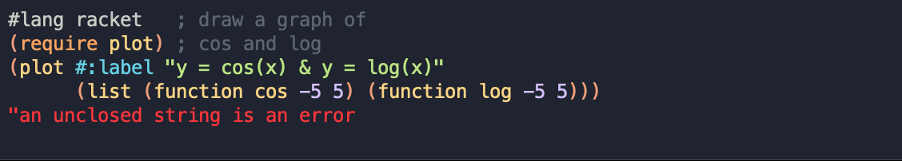

# drracket-ayu-mirage
🎨 An ayu mirage color scheme for DrRacket



## Installation
```sh
git clone https://github.com/oransimhony/drracket-ayu-mirage.git
raco pkg install ./drracket-ayu-mirage
```
Install directly from GitHub
```sh
raco pkg install git://github.com/oransimhony/drracket-ayu-mirage
```

## Credits

* Learned how to write a color scheme based on [tuirgin/base16-drracket](https://github.com/tuirgin/base16-drracket)

## Authors

* **Oran Simhony** - [oransimhony](https://github.com/oransimhony)
